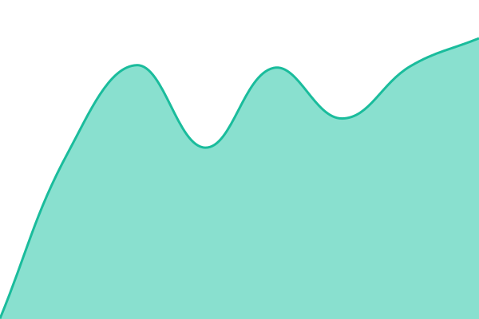
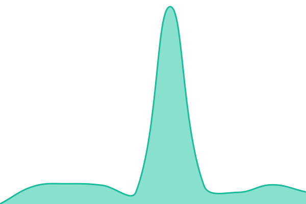
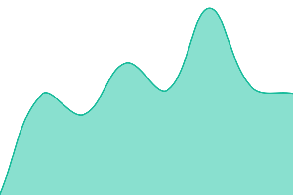
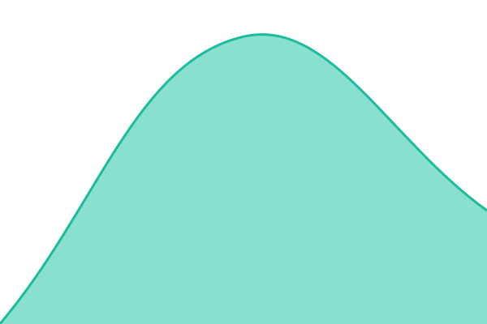
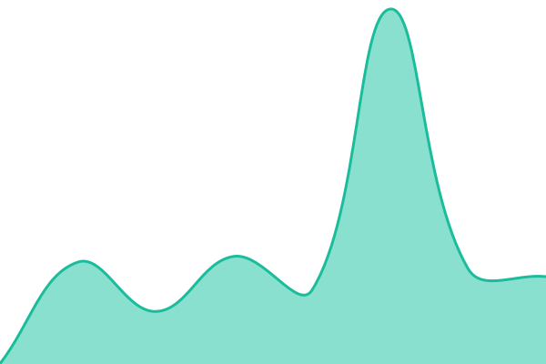
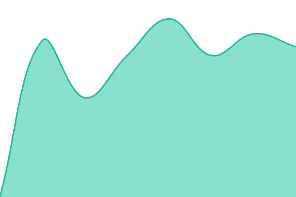

# [📈 Live Status](https://robertormzg.github.io/upptime-dgdc): <!--live status--> **🟧 Partial outage**

This repository contains the open-source uptime monitor and status page for [robertormzg](https://robertormzg.github.io/upptime-dgdc), powered by [Upptime](https://github.com/upptime/upptime).

With [Upptime](https://upptime.js.org), you can get your own unlimited and free uptime monitor and status page, powered entirely by a GitHub repository. We use [Issues](https://github.com/robertormzg/upptime-dgdc/issues) as incident reports, [Actions](https://github.com/robertormzg/upptime-dgdc/actions) as uptime monitors, and [Pages](https://robertormzg.github.io/upptime-dgdc) for the status page.

<!--start: status pages-->
<!-- This summary is generated by Upptime (https://github.com/upptime/upptime) -->
<!-- Do not edit this manually, your changes will be overwritten -->
<!-- prettier-ignore -->
| URL | Status | History | Response Time | Uptime |
| --- | ------ | ------- | ------------- | ------ |
|  [Divulgación de la Ciencia UNAM](https://www.dgdc.unam.mx) | 🟥 Down | [divulgacion-de-la-ciencia-unam.yml](https://github.com/robertormzg/upptime-dgdc/commits/HEAD/history/divulgacion-de-la-ciencia-unam.yml) | 

 945ms
     
 | 

<a href="https://robertormzg.github.io/upptime-dgdc/history/divulgacion-de-la-ciencia-unam">94.18%</a>
    

|  [Boletos DGDC](https://boletos.dgdc.unam.mx/) | 🟩 Up | [boletos-dgdc.yml](https://github.com/robertormzg/upptime-dgdc/commits/HEAD/history/boletos-dgdc.yml) | 

 511ms
     
 | 

<a href="https://robertormzg.github.io/upptime-dgdc/history/boletos-dgdc">100.00%</a>
    

|  [Universum](https://www.universum.unam.mx) | 🟥 Down | [universum.yml](https://github.com/robertormzg/upptime-dgdc/commits/HEAD/history/universum.yml) | 

 516ms
     
 | 

<a href="https://robertormzg.github.io/upptime-dgdc/history/universum">94.23%</a>
    

|  [Ciencia UNAM](https://ciencia.unam.mx) | 🟥 Down | [ciencia-unam.yml](https://github.com/robertormzg/upptime-dgdc/commits/HEAD/history/ciencia-unam.yml) | 

 1177ms
     
 | 

<a href="https://robertormzg.github.io/upptime-dgdc/history/ciencia-unam">94.27%</a>
    

|  [Revista Cómo ves](https://www.comoves.unam.mx) | 🟥 Down | [revista-como-ves.yml](https://github.com/robertormzg/upptime-dgdc/commits/HEAD/history/revista-como-ves.yml) | 

 452ms
     
 | 

<a href="https://robertormzg.github.io/upptime-dgdc/history/revista-como-ves">94.32%</a>
    

|  [Museo de la Luz](https://www.museodelaluz.unam.mx) | 🟥 Down | [museo-de-la-luz.yml](https://github.com/robertormzg/upptime-dgdc/commits/HEAD/history/museo-de-la-luz.yml) | 

 328ms
     
 | 

<a href="https://robertormzg.github.io/upptime-dgdc/history/museo-de-la-luz">94.37%</a>
    

|  [Educación continua](https://educacioncontinua.dgdc.unam.mx) | 🟥 Down | [educacion-continua.yml](https://github.com/robertormzg/upptime-dgdc/commits/HEAD/history/educacion-continua.yml) | 

 402ms
     
 | 

<a href="https://robertormzg.github.io/upptime-dgdc/history/educacion-continua">94.42%</a>
    

|  [e-learning Universum](https://e-learning.universum.unam.mx/) | 🟥 Down | [e-learning-universum.yml](https://github.com/robertormzg/upptime-dgdc/commits/HEAD/history/e-learning-universum.yml) | 

 836ms
     
 | 

<a href="https://robertormzg.github.io/upptime-dgdc/history/e-learning-universum">94.47%</a>
    

|  [Temasili](https://temasili.dgdc.unam.mx) | 🟥 Down | [temasili.yml](https://github.com/robertormzg/upptime-dgdc/commits/HEAD/history/temasili.yml) | 

 516ms
     
 | 

<a href="https://robertormzg.github.io/upptime-dgdc/history/temasili">94.51%</a>
    

|  [Ameyalli](https://ru.ameyalli.dgdc.unam.mx) | 🟩 Up | [ameyalli.yml](https://github.com/robertormzg/upptime-dgdc/commits/HEAD/history/ameyalli.yml) | 

 339ms
     
 | 

<a href="https://robertormzg.github.io/upptime-dgdc/history/ameyalli">100.00%</a>
    

|  [UNAMirada a la Ciencia](http://www.unamiradaalaciencia.unam.mx/) | 🟩 Up | [una-mirada-a-la-ciencia.yml](https://github.com/robertormzg/upptime-dgdc/commits/HEAD/history/una-mirada-a-la-ciencia.yml) | 

 420ms
     
 | 

<a href="https://robertormzg.github.io/upptime-dgdc/history/una-mirada-a-la-ciencia">100.00%</a>
    

|  [UNAM](https://www.unam.mx) | 🟩 Up | [unam.yml](https://github.com/robertormzg/upptime-dgdc/commits/HEAD/history/unam.yml) | 

 381ms
     
 | 

<a href="https://robertormzg.github.io/upptime-dgdc/history/unam">100.00%</a>
    

<!--end: status pages-->

[**Visit our status website →**](https://robertormzg.github.io/upptime-dgdc)

## 📄 License

- Powered by: [Upptime](https://github.com/upptime/upptime)
- Code: [MIT](./LICENSE) © [robertormzg](https://robertormzg.github.io/upptime-dgdc)
- Data in the `./history` directory: [Open Database License](https://opendatacommons.org/licenses/odbl/1-0/)
